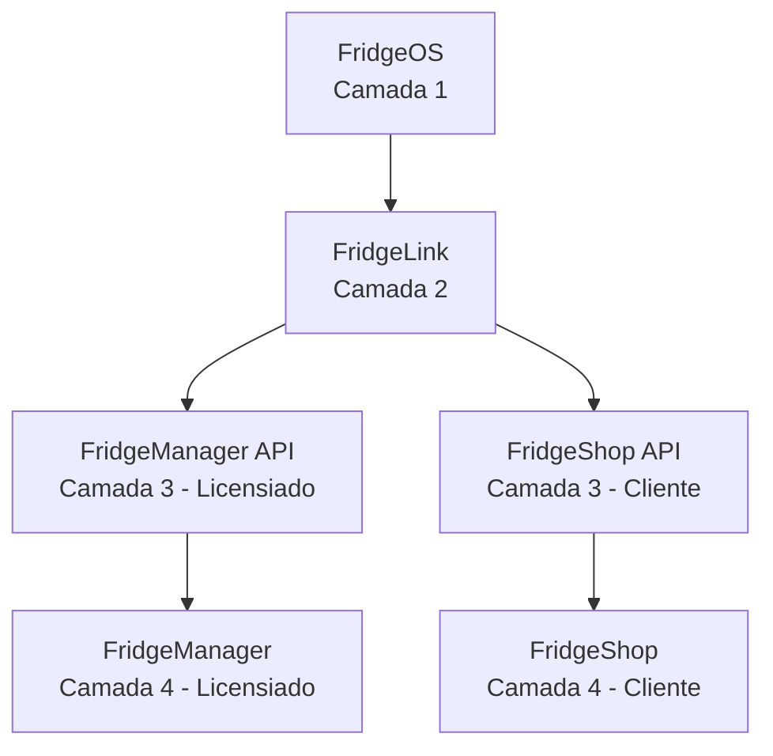

# 🧊 Fridge Ecosystem

## 📖 Visão Geral
O **Fridge Ecosystem** é uma plataforma completa para gerenciamento de geladeiras inteligentes, integrando hardware embarcado, backends especializados e frontends dedicados para **licensiados** (donos de geladeiras) e **clientes** (usuários finais).  

A missão do projeto é **maximizar a rentabilidade do licensiado** e **simplificar a experiência de compra do cliente**, garantindo um ecossistema escalável, seguro e de fácil manutenção.

---

## 🏗️ Arquitetura em Camadas

### Descrição das Camadas
- **FridgeOS (Camada 1):** Sistema embarcado na Raspberry Pi, responsável por sensores, atuadores e coleta de dados.  
- **FridgeLink (Camada 2):** Gateway de comunicação, abstraindo eventos entre FridgeOS e os serviços na nuvem.  
- **FridgeManager API (Camada 3):** Backend orientado ao licensiado para gestão, métricas e manutenção.  
- **FridgeShop API (Camada 3):** Backend orientado ao cliente, responsável por autenticação, compras e pagamentos.  
- **FridgeManager (Camada 4):** Frontend para o licensiado, com painel de controle e métricas de operação.  
- **FridgeShop (Camada 4):** Frontend para o cliente final, com interface de compra e interação com a geladeira.  

---

## 📦 Repositórios

- [FridgeOS](./fridge-os) – Sistema embarcado na Raspberry Pi.  
- [FridgeLink](./fridge-link) – Gateway backend que conecta as geladeiras à nuvem.  
- [FridgeManager API](./fridge-manager-api) – Backend para o licensiado gerenciar suas geladeiras.  
- [FridgeShop API](./fridge-shop-api) – Backend para o cliente realizar compras.  
- [FridgeManager](./fridge-manager) – Frontend para o licensiado (painel de controle).  
- [FridgeShop](./fridge-shop) – Frontend para o cliente final (app/web de compras).  

---

## 🚀 Roadmap Macro

### MVP
- Comunicação **FridgeOS → FridgeLink → FridgeManager API**.  
- Dashboard inicial do licensiado (**FridgeManager**).  

### Iteração 2
- Fluxo completo do cliente (**FridgeShop API + FridgeShop**).  
- Autenticação e pagamentos básicos.  

### Iteração 3
- Monitoramento avançado (alertas de temperatura, estoque e falhas).  
- Integração com meios de pagamento (PIX, cartão).  

---

## ⚙️ Padrões de Engenharia e Gestão

- **Controle de versão:** GitFlow (branches `main`, `develop`, `feature/*`, `bugfix/*`, `documentation/*`).  
- **CI/CD:** GitHub Actions com testes automatizados, build e deploy.  
- **Documentação:** OpenAPI/Swagger para contratos de API.  
- **Infraestrutura:** Contêineres Docker, com opção de Kubernetes para escalabilidade.  
- **Gerência de Projeto:** Kanban no GitHub Projects.  
